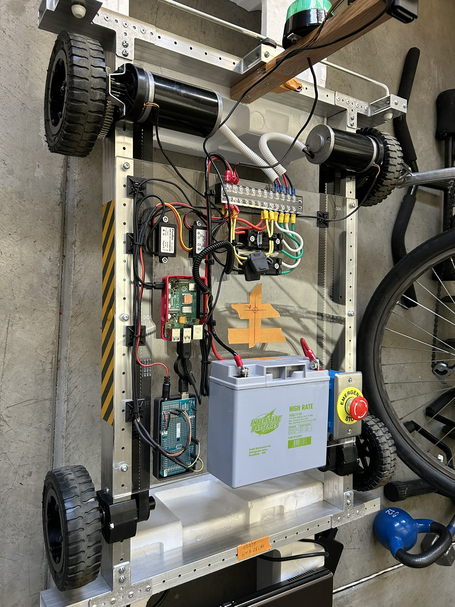
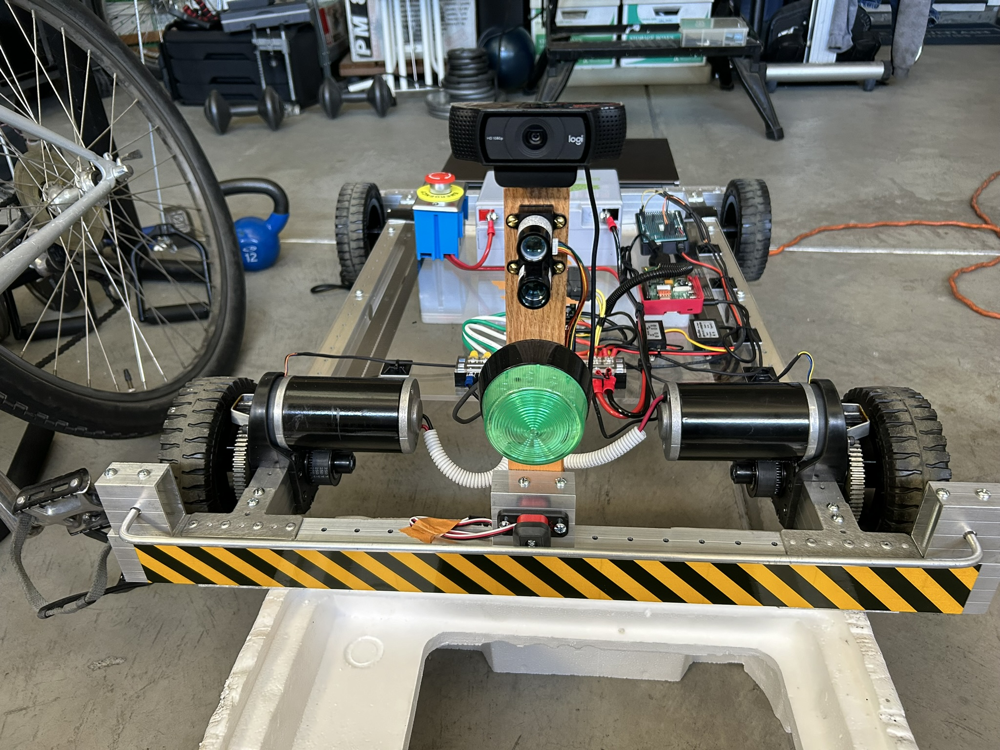

# robogames_2024




This repository contains the code used for a RoboMagellan outdoor navigation
robotics competition.

## Dependencies

The robot is running Ubuntu 24.04 and needs ROS 2 Jazzy installed.

Install the following dependencies:
```
libserial-dev
```

## New Robot Installation Steps

1) Install Ubuntu 24.04 (Noble) onto a Raspberry Pi 5 Micro SD card.

2) Run `setup_pi.sh` to remove unneeded programs and install dependencies.

2) On an Arduino Mega flash in the Arduino code `robomagellan_2024.ino` inside
the `arduino_code` directory.

3) Copy the `99-arduino.rules` from the `udev_rules` directory into
`/etc/udev/rules.d` so the Arduino Mega will be associated with the device file
`/dev/arduino`.  Be sure to call `sudo udevadm control --reload-rules && sudo
udevadm trigger` to apply this rule.

4) Ensure Ubuntu 24.04 has I2C support enabled by checking
`/boot/firmware/config.txt` and ensuring that `dtparam=i2c_arm=on`.

5) Build the `ros2` workspace by executing `colcon build` inside
`robogames_2024/ros2_ws`.

## Running the Robot

The `robomagellan_bringup` package contains the launch files used to start the
robot for a RoboMagellan competition.  Please run:
`ros2 launch robomagellan_bringup competition.launch.py` to start the robot.
